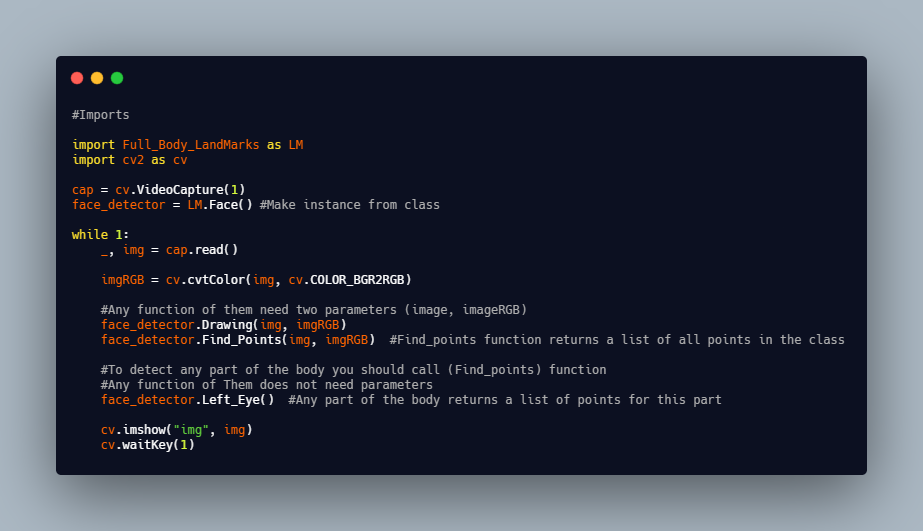

# Full_Body_LandMarks

### Explained

In this repo used [Mediapipe](https://google.github.io/mediapipe/solutions/solutions.html) solutions in sections

- Face Mesh
- Hands
- Pose

Togther and achieved all coordinates every point

**Divide [Face Mesh](https://google.github.io/mediapipe/solutions/face_mesh.html) into :-**

Face Mesh images points in folder 

- Left Eye
- Right Eye
- Nose
- Mouth
- Head

**Divide [Hands](https://google.github.io/mediapipe/solutions/hands.html) into :-**

- Fingers

**Divide [Pose](https://google.github.io/mediapipe/solutions/pose.html) into :-**

- Chest
- Arms
- Legs

### Installation
[Doownlad](https://codeload.github.com/kouwis/Full_Body_LandMarks/zip/refs/heads/main) package and put it in your project folder and import it as any packages such as: **Numpy**, **Math**

### Usage

