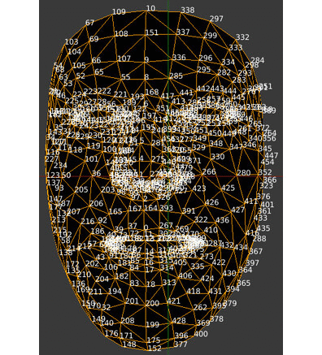

# Full_Body_LandMarks

### Explained

In this repo used [Mediapipe](https://google.github.io/mediapipe/solutions/solutions.html) solutions in sections

- Face Mesh
- Hands
- Pose

Togther and achieved all coordinates every point

**Divide Face Mesh into :-**

- Left Eye
- Right Eye
- Nose
- Mouth
- Head

**Divide Hands into :-**

- Fingers

**Divide body into :-**

- Chest
- Arms
- Legs
